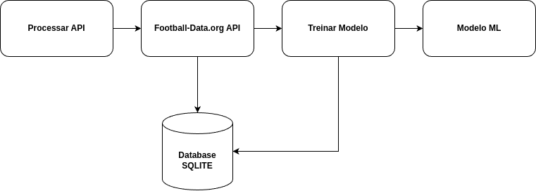

# Tech Challenge 03 <!-- omit in toc -->

- [Preditor de Resultados - Campeonato Brasileiro Série A](#preditor-de-resultados---campeonato-brasileiro-série-a)
- [Sobre o Projeto](#sobre-o-projeto)
- [Dados Utilizados](#dados-utilizados)
- [Como Executar](#como-executar)
  - [Clone o repositório](#clone-o-repositório)
  - [Criar ambiente Python](#criar-ambiente-python)
  - [Ativar ambiente Python](#ativar-ambiente-python)
- [Executar localmente](#executar-localmente)

## Preditor de Resultados - Campeonato Brasileiro Série A

Este projeto em Python utiliza **aprendizado de máquina** para prever o desempenho de um time no _Campeonato Brasileiro Série A_ com base em dados estatísticos de partidas.

## Sobre o Projeto

A aplicação realiza três principais tarefas:

1. **Processar API**: Consulta a [Football Data API](https://www.football-data.org) para obter dados atualizados das partidas do Campeonato Brasileiro Série A e armazena as informações no banco de dados.
2. **Treinar Modelo**: Utiliza os dados salvos para treinar um modelo de machine learning em um arquivo `modelo_campeao.pkl`.
3. **Consultar**: Permite enviar os dados de uma partida para o modelo e receber uma predição.



## Dados Utilizados

A predição é feita com base em quatro métricas principais de uma partida:

- `Chutes a gol`
- `Finalizações`
- `Escanteios`
- `Gols`

## Como Executar

### Clone o repositório

```bash
git clone git@github.com:valhallaml/tech-challenge-03.git
cd tech-challenge-03
```

### Criar ambiente Python

```bash
python -m venv .venv
```

### Ativar ambiente Python

```bash
source .venv/bin/activate
```

## Executar localmente

> Antes de executar, copie `.env.sample` e renomeie para `.env`. Substitua as variáveis ​​pelos valores corretos.

```bash
pip install -r requirements.txt
python src/main.py
```
